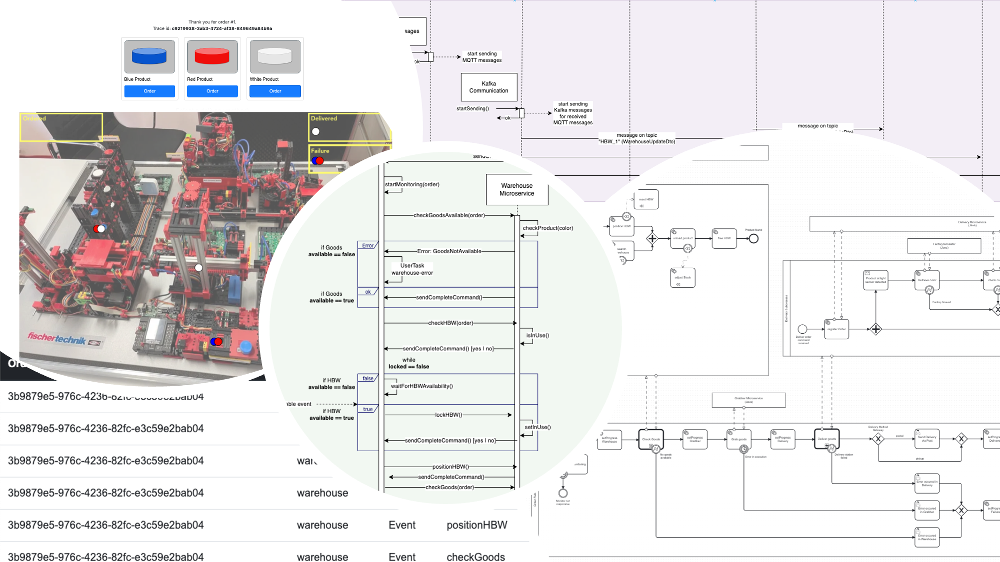

# EDPO - Group 1

Our Project for the Event-Driven and Process-Oriented Architecture course at the University of St. Gallen.
We are building an Application, that interacts with the Smart Factory and simulates a process of ordering a product.
A user can order a product, which will be removed from the HighBay Warehouse (HBW_1), transported to the Grabber (VGR_1),
then to the Delivery Station and finally delivered to the user.

## Documents

* Service READMEs: In the respective service folders
* Architectual Decision Records (ADRs): [adrs](docs/adrs)
* BMPN Diagrams: [bmpns](docs/images/bmpns)
* Sequence Diagram: [sequence_diagram.pdf](docs/sequence_diagram/sequence_diagram.drawio.pdf)
* Intermediate Presentation PDF: [intermediate_presentation.pdf](docs/intermediate_presentation.pdf)
* Final Presentation PDF: [intermediate_presentation.pdf](docs/final_presentation.pdf)
* Word Document, hand-in for Assignment 1: [intermediate_report.pdf](docs/intermediate_report.pdf)
* Word Document, hand-in for Assignment 2: [intermediate_report.pdf](docs/report.pdf)
* Demo Instructions: See below
* Previous hand-ins, Exercises 1-4: [https://github.com/KaiTries/EDPO-Group1](https://github.com/KaiTries/EDPO-Group1)

## Services

The application is built with a microservice architecture and uses Kafka, Camunda and MQTT to communicate between the
services. For the implementation of the Workflows Camunda 8 has been used. The services are built with Spring Boot.
The services are (click on the links for their respective READMEs):

* [Order Service](order/README.md)
* [Warehouse Service](warehouse/README.md)
* [Grabber Service](grabber/README.md)
* [Delivery Service](delivery/README.md)
* [Factory Simulator](factorysimulator/README.md)
* [Factory Listener](factorylistener/README.md)
* [Monitoring Service](monitoring/README.md)
* [Streamprocessor Service](streamprocessor/README.md)

## Demo Instructions

1. Clone the repository

```bash
git clone https://github.com/jonaslanzlinger/EDPO-Group1-Project.git
```

2. In the project root, run `docker compose up --build`
    * This will start the following containers:
        * zookeeper
        * kafka
        * mqtt
        * order
        * warehouse
        * grabber
        * delivery
        * factorysimulator
        * factorylistener
        * monitoring
        * streamprocessor

> NOTE: In case you run the project with the simulated factory it is crucial to do steps 3-6 in a timely manner (about 30 seconds) because
> the factory simulator emits MQTT messages with the content of the data dump of a live factory recording. Therefore, you will also need
> to test with the exact same order as we did in the live factory recording (blue, red, white - 3 orders).
> In case you run the project with the real factory, step 3 is skipped. (Please get in touch with one of us. We would setup everything for you in this case.)

3. (only Simulated Factory) Open the browser and go to `http://localhost:8085/send` to start the factory simulator.
   MQTT messages will be produced each tenth of a second from now.

4. Open another browser tab and go to `http://localhost:8084/send` to start the factory listener.
   The MQTT messages from the factory will now get relayed to the other services via Kafka.

5. Open another browser tab and go to `http://localhost:8080/order.html`

6. Issue 3 orders in that sequence: Blue, Red, White (This is necessary because the simulated data is for those 3 order types)

7. The order should be processed automatically through the warehouse and the grabber.

8. Depending on whether the delivery was successful or not, you will need to complete a user task within
   the camunda tasklist.

9. Hint: Check the logs of the services to see the messages being processed.

10. Hint: Check online through camunda the process instances and tasks.

11. Hint: Check the monitoring service to see the metrics of the factory.

* Go to `http://localhost:8086/` to see the monitoring of the single camunda tasks (grouped by id) that are propagated trough kafka. 
* Go to `http://localhost:8086/factory` to see the monitoring of the factory (e.g color stats, average values) that come from streamprocessing.
